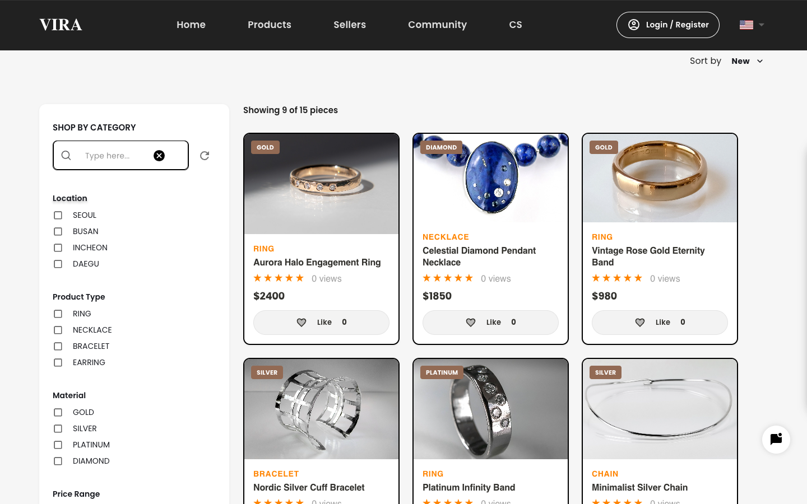
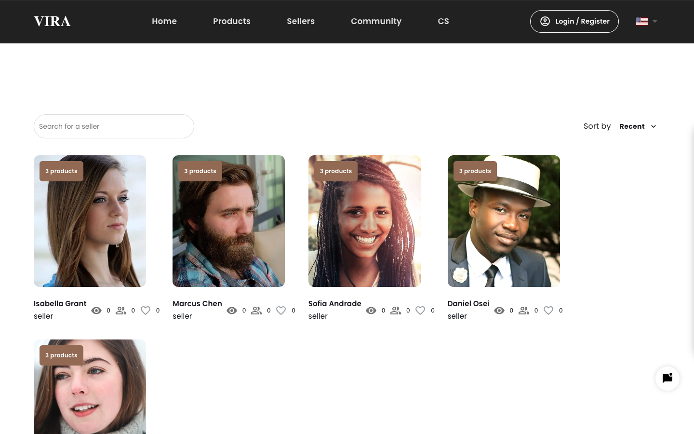
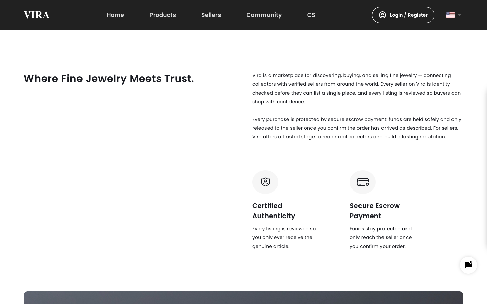

# Vira — Fine Jewelry Marketplace

Vira is a full-stack marketplace for discovering, buying, and selling fine
jewelry from verified sellers. This repo is the customer-facing web app
(buyers, sellers, and an admin dashboard); the GraphQL/WebSocket API lives in
the companion [`vira`](https://github.com/Sherzod-1998/vira) backend repo.

**Live demo:** _add your deployed Vercel URL here_
**Backend repo:** https://github.com/Sherzod-1998/vira


<details>
<summary>More screenshots</summary>





</details>

## Features

- **Product marketplace** — browse, filter (type/material/location/price),
  sort, and search jewelry listings; product detail pages with an image
  gallery, reviews, and related items.
- **Sellers** — public seller directory and profiles, follow/like, seller
  stats, and a per-seller product catalog.
- **Community** — a discussion board with categories, comments, and likes.
- **Real-time** — a WebSocket-backed live chat and notification feed.
- **Accounts** — email/phone signup and login, Google OAuth, buyer and
  seller account types.
- **Admin dashboard** — manage members, products, community posts, notices,
  and support inquiries, gated by a server-side role check (Next.js
  middleware verifying the caller's role against the backend, not a
  client-decoded token).
- **Internationalization** — English, Korean, and Russian, including
  right-to-left-safe layout and locale-aware number/date formatting.

## Tech stack

- **Next.js 14** (Pages Router) + **TypeScript**
- **Apollo Client** for GraphQL, with a WebSocket link for subscriptions/chat
- **Material UI** for components, custom SCSS for page-specific styling
- **next-i18next** for i18n (en / kr / ru)
- **next/image** for optimized, responsive images throughout
- **Playwright**-verified UI (see [Testing](#testing))

## Architecture notes

- Auth uses a JWT issued by the backend, cached in `localStorage` for the
  client and mirrored into a cookie so Next.js **middleware** can verify a
  caller's role server-side before rendering `/_admin/**` — the client-decoded
  JWT is used for UI only and is never trusted for access control.
- The WebSocket client authenticates with a post-connect `{event: 'auth'}`
  message instead of a token in the connection URL, so the token never lands
  in proxy or browser history logs.
- Apollo's error link clears the local session on `UNAUTHENTICATED`/401
  responses instead of leaving the app in a half-logged-in state.

## Getting started

```bash
yarn install
cp .env.example .env.local   # point at your local or deployed backend
yarn dev                     # http://localhost:3000
```

### Environment variables

| Variable | Description |
|---|---|
| `REACT_APP_API_URL` | Backend REST/health base URL |
| `REACT_APP_API_GRAPHQL_URL` | Backend GraphQL endpoint |
| `REACT_APP_API_WS` | Backend WebSocket URL (Apollo subscriptions) |
| `NEXT_PUBLIC_CHAT_WS_URL` | Backend WebSocket URL (chat) |

The backend repo's README documents the matching server-side setup.

## Testing

```bash
yarn lint        # ESLint
npx tsc --noEmit # type-check
```

_Automated UI tests are not yet part of this repo — see the backend for unit
test coverage._

## Deploying

This app deploys cleanly to Vercel. After deploying the backend (see its
README), set the four environment variables above to the deployed backend's
URLs in your Vercel project, for both Production and Preview.

## License

MIT
